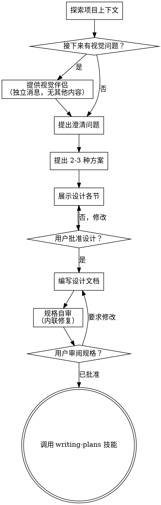

# 将想法头脑风暴为设计方案

通过自然的协作对话，帮助将想法转化为完整的设计和规格说明。

首先了解当前项目上下文，然后逐一提问来细化想法。一旦理解了要构建什么，就展示设计并获得用户批准。

<HARD-GATE>
在展示设计并获得用户批准之前，不要调用任何实现技能、编写任何代码、搭建任何项目或采取任何实现行动。这适用于每个项目，无论其看起来多么简单。
</HARD-GATE>

## 反模式："这太简单了，不需要设计"

每个项目都要经过这个流程。一个待办列表、一个单函数工具、一个配置变更——全都一样。"简单"的项目恰恰是未检验的假设造成最多浪费工作的地方。设计可以很简短（对于真正简单的项目几句话即可），但你必须展示它并获得批准。

## 检查清单

你必须为以下每一项创建任务并按顺序完成：

1. **探索项目上下文** —— 检查文件、文档、最近的提交
2. **提供视觉伴侣**（如果主题涉及视觉问题）—— 这是一条独立的消息，不要与澄清问题合并。参见下方视觉伴侣部分。
3. **提出澄清问题** —— 一次一个，理解目的/约束/成功标准
4. **提出 2-3 种方案** —— 附带权衡分析和你的推荐
5. **展示设计** —— 按复杂度调整各节篇幅，每节后获得用户批准
6. **编写设计文档** —— 保存到 `docs/superpowers/specs/YYYY-MM-DD-<topic>-design.md` 并提交
7. **规格自审** —— 快速内联检查占位符、矛盾、歧义、范围（见下文）
8. **用户审阅书面规格** —— 在继续之前请用户审阅规格文件
9. **过渡到实现** —— 调用 writing-plans 技能创建实现计划

## 流程图

**终止状态是调用 writing-plans。** 不要调用 frontend-design、mcp-builder 或任何其他实现技能。头脑风暴之后你调用的唯一技能是 writing-plans。

## 流程

**理解想法：**

- 首先查看当前项目状态（文件、文档、最近提交）
- 在提出详细问题之前，先评估范围：如果请求描述了多个独立子系统（例如"构建一个包含聊天、文件存储、账单和分析的平台"），请立即标记。不要花时间在需要先分解的项目上细化细节。
- 如果项目太大无法放入单一规格，帮助用户分解为子项目：哪些是独立的部分，它们如何关联，应该按什么顺序构建？然后通过正常设计流程对第一个子项目进行头脑风暴。每个子项目都有自己的规格 → 计划 → 实现周期。
- 对于范围适当的项目，逐一提问来细化想法
- 尽可能使用选择题，开放式也可以
- 每条消息只问一个问题——如果某个主题需要更多探索，拆分为多个问题
- 聚焦于理解：目的、约束、成功标准

**探索方案：**

- 提出 2-3 种不同方案并附带权衡分析
- 以对话方式展示选项，附上你的推荐和理由
- 优先展示推荐选项并解释原因

**展示设计：**

- 一旦你认为理解了要构建什么，就展示设计
- 各节篇幅按复杂度调整：简单的话几句话，复杂的话最多 200-300 字
- 每节之后询问目前是否正确
- 覆盖：架构、组件、数据流、错误处理、测试
- 准备好在某处不合理时返回澄清

**为隔离性和清晰性设计：**

- 将系统分解为更小的单元，每个单元有单一明确目的，通过良好定义的接口通信，可以独立理解和测试
- 对于每个单元，你应该能回答：它做什么，怎么使用它，它依赖什么？
- 有人能在不阅读内部实现的情况下理解一个单元做什么吗？你能在不破坏调用方的情况下修改内部实现吗？如果不能，边界需要调整。
- 更小、边界清晰的单元也更容易让你处理——你更能理解可以一次性放入上下文的代码，当文件聚焦时你的编辑更可靠。当文件变大时，这通常是它做了太多事情的信号。

**在现有代码库中工作：**

- 在提议变更之前探索当前结构。遵循已有模式。
- 当现有代码存在影响当前工作的问题（例如文件增长过大、边界不清、职责纠缠），将针对性改进作为设计的一部分——就像优秀的开发者在他们工作的代码中改进代码一样。
- 不要提议无关的重构。聚焦于服务当前目标的部分。

## 设计之后

**文档：**

- 将验证过的设计（规格）写入 `docs/superpowers/specs/YYYY-MM-DD-<topic>-design.md`
  - （用户对规格位置的偏好覆盖此默认值）
- 如果可用，使用 elements-of-style:writing-clearly-and-concisely 技能
- 将设计文档提交到 git

**规格自审：**
编写规格文档后，以全新的眼光审视它：

1. **占位符扫描：** 是否有"TBD"、"TODO"、不完整的章节或模糊的需求？修复它们。
2. **内部一致性：** 是否有章节互相矛盾？架构是否与功能描述匹配？
3. **范围检查：** 这是否足够聚焦于单一实现计划，还是需要分解？
4. **歧义检查：** 是否有需求可以被两种不同方式解读？如果是，选择一种并明确说明。

内联修复任何问题。不需要重新审阅——修复后继续。

**用户审阅关卡：**
规格审阅循环通过后，请用户在继续之前审阅书面规格：

> "规格已编写并提交到 `<path>`。请审阅并告诉我是否要在我们开始编写实现计划之前做任何修改。"

等待用户的回复。如果他们要求修改，进行修改并重新运行规格审阅循环。只有在用户批准后才继续。

**实现：**

- 调用 writing-plans 技能创建详细的实现计划
- 不要调用任何其他技能。writing-plans 是下一步。

## 核心原则

- **一次一个问题** —— 不要用多个问题淹没用户
- **优先选择题** —— 可能时比开放式更容易回答
- **严格执行 YAGNI** —— 从所有设计中移除不必要的功能
- **探索替代方案** —— 在确定之前始终提出 2-3 种方案
- **增量验证** —— 展示设计，在继续之前获得批准
- **保持灵活** —— 在某处不合理时返回澄清
