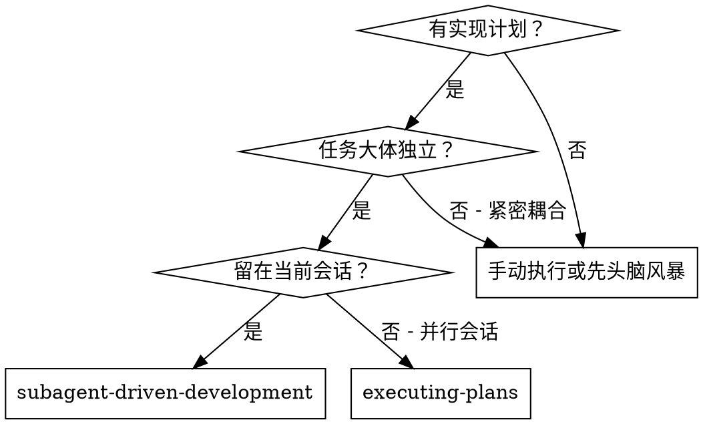
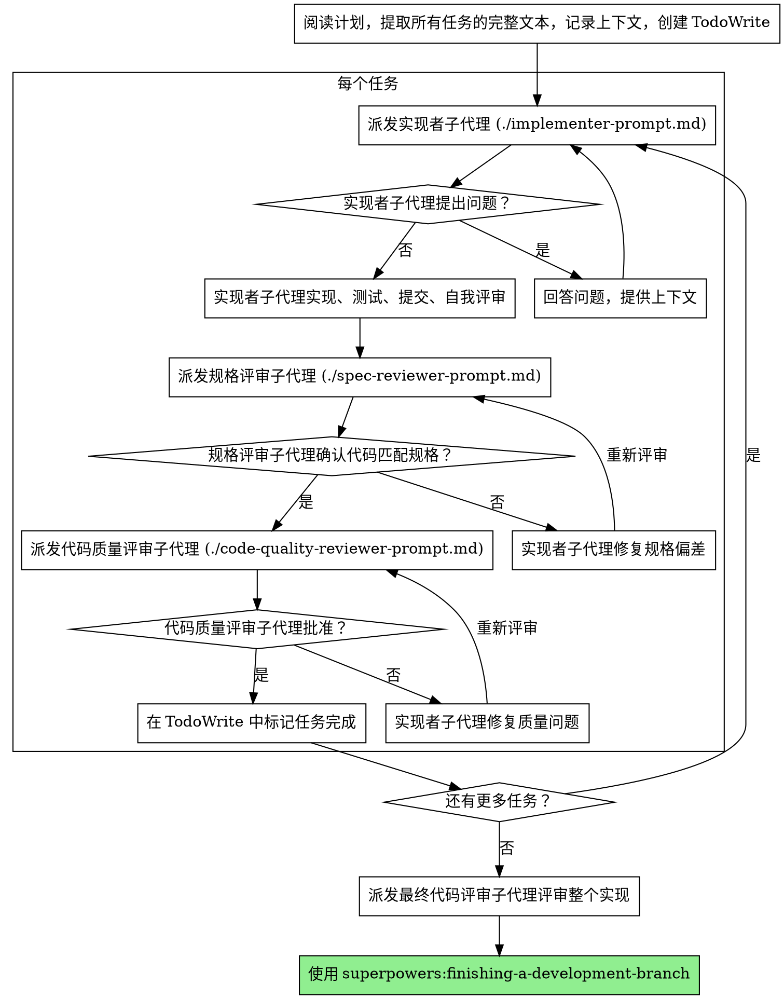

# 子代理驱动开发

通过为每个任务派发全新子代理来执行计划，每个任务完成后进行两阶段评审：先进行规格合规评审，再进行代码质量评审。

**为什么使用子代理：** 你将任务委托给具有隔离上下文的专用代理。通过精确构建它们的指令和上下文，你确保它们保持专注并成功完成任务。它们绝不应继承你会话的上下文或历史——你精确构建它们所需的内容。这也保留了你自己的上下文用于协调工作。

**核心原则：** 每个任务使用全新子代理 + 两阶段评审（先规格后质量）= 高质量、快速迭代

## 何时使用



**对比执行计划（并行会话）：**
- 同一会话（无上下文切换）
- 每个任务使用全新子代理（无上下文污染）
- 每个任务后进行两阶段评审：先规格合规，再代码质量
- 更快的迭代（任务之间无需人工介入）

## 流程



## 模型选择

使用能处理每个角色的最低能力模型，以节省成本并提高速度。

**机械性实现任务**（隔离的函数、明确的规格、1-2 个文件）：使用快速、廉价的模型。当计划规格明确时，大多数实现任务都是机械性的。

**集成和判断任务**（多文件协调、模式匹配、调试）：使用标准模型。

**架构、设计和评审任务**：使用最强大的可用模型。

**任务复杂度信号：**
- 涉及 1-2 个文件且有完整规格 → 廉价模型
- 涉及多个文件且有集成考虑 → 标准模型
- 需要设计判断或广泛的代码库理解 → 最强模型

## 处理实现者状态

实现者子代理报告四种状态之一。分别妥善处理：

**DONE：** 进入规格合规评审。

**DONE_WITH_CONCERNS：** 实现者完成了工作但标记了疑虑。在继续之前阅读这些顾虑。如果顾虑是关于正确性或范围的，在评审前解决。如果是观察性的（例如"这个文件变得很大"），记录下来并继续评审。

**NEEDS_CONTEXT：** 实现者需要未提供的信息。提供缺失的上下文并重新派发。

**BLOCKED：** 实现者无法完成任务。评估阻塞原因：
1. 如果是上下文问题，提供更多上下文并使用相同模型重新派发
2. 如果任务需要更多推理能力，使用更强模型重新派发
3. 如果任务太大，将其分解为更小的部分
4. 如果计划本身有误，上报给人类

**绝不**忽略上报或在没有变更的情况下强制使用相同模型重试。如果实现者说卡住了，就需要做出改变。

## 提示模板

- `./implementer-prompt.md` - 派发实现者子代理
- `./spec-reviewer-prompt.md` - 派发规格合规评审子代理
- `./code-quality-reviewer-prompt.md` - 派发代码质量评审子代理

## 示例工作流

```
你：我正在使用子代理驱动开发来执行这个计划。

[读取计划文件一次：docs/superpowers/plans/feature-plan.md]
[提取所有 5 个任务的完整文本和上下文]
[创建包含所有任务的 TodoWrite]

任务 1：Hook 安装脚本

[获取任务 1 的文本和上下文（已提取）]
[派发实现子代理，提供完整任务文本 + 上下文]

实现者："开始之前 - hook 应该安装在用户级还是系统级？"

你："用户级（~/.config/superpowers/hooks/）"

实现者："明白了。开始实现..."
[稍后] 实现者：
  - 实现了 install-hook 命令
  - 添加了测试，5/5 通过
  - 自我评审：发现遗漏了 --force 标志，已添加
  - 已提交

[派发规格合规评审]
规格评审：✅ 规格合规 - 所有需求已满足，没有多余内容

[获取 git SHA，派发代码质量评审]
代码评审：优点：良好的测试覆盖，整洁。问题：无。已批准。

[标记任务 1 完成]

任务 2：恢复模式

[获取任务 2 的文本和上下文（已提取）]
[派发实现子代理，提供完整任务文本 + 上下文]

实现者：[无问题，继续]
实现者：
  - 添加了 verify/repair 模式
  - 8/8 测试通过
  - 自我评审：一切正常
  - 已提交

[派发规格合规评审]
规格评审：❌ 问题：
  - 缺失：进度报告（规格要求"每 100 项报告一次"）
  - 多余：添加了 --json 标志（未要求）

[实现者修复问题]
实现者：移除了 --json 标志，添加了进度报告

[规格评审再次评审]
规格评审：✅ 现在规格合规

[派发代码质量评审]
代码评审：优点：扎实。问题（重要）：魔法数字（100）

[实现者修复]
实现者：提取了 PROGRESS_INTERVAL 常量

[代码评审再次评审]
代码评审：✅ 已批准

[标记任务 2 完成]

...

[所有任务完成后]
[派发最终代码评审]
最终评审：所有需求已满足，准备好合并

完成！
```

## 优势

**对比手动执行：**
- 子代理自然遵循 TDD
- 每个任务使用全新上下文（无混淆）
- 并行安全（子代理不会互相干扰）
- 子代理可以提问（工作前和工作期间）

**对比执行计划：**
- 同一会话（无交接）
- 持续进展（无需等待）
- 自动评审检查点

**效率提升：**
- 无文件读取开销（控制器提供完整文本）
- 控制器精确策划所需的上下文
- 子代理预先获得完整信息
- 问题在工作开始前就暴露（而非之后）

**质量关卡：**
- 自我评审在交接前捕获问题
- 两阶段评审：规格合规，然后代码质量
- 评审循环确保修复真正有效
- 规格合规防止过度/不足构建
- 代码质量确保实现构建良好

**成本：**
- 更多子代理调用（每个任务：实现者 + 2 个评审者）
- 控制器做更多准备工作（预先提取所有任务）
- 评审循环增加迭代次数
- 但能尽早发现问题（比事后调试更划算）

## 危险信号

**绝不：**
- 在未经用户明确同意的情况下在 main/master 分支上开始实现
- 跳过评审（规格合规或代码质量）
- 在有未修复问题的情况下继续推进
- 并行派发多个实现子代理（会产生冲突）
- 让子代理读取计划文件（改为提供完整文本）
- 跳过场景设定上下文（子代理需要理解任务的定位）
- 忽略子代理的问题（在让他们继续之前必须回答）
- 对规格合规接受"差不多就行"（规格评审发现问题 = 未完成）
- 跳过评审循环（评审者发现问题 = 实现者修复 = 再次评审）
- 让实现者的自我评审替代正式评审（两者都需要）
- **在规格合规评审通过 ✅ 之前开始代码质量评审**（顺序不能错）
- 在任一评审有未解决问题的情况下进入下一个任务

**如果子代理提出问题：**
- 清晰完整地回答
- 如有需要提供额外上下文
- 不要催促他们进入实现

**如果评审者发现问题：**
- 实现者（同一子代理）修复它们
- 评审者再次评审
- 重复直到批准
- 不要跳过重新评审

**如果子代理失败：**
- 派发修复子代理并提供具体指令
- 不要尝试手动修复（上下文污染）

## 集成

**必需的工作流技能：**
- **superpowers:using-git-worktrees** - 必需：开始前设置隔离工作区
- **superpowers:writing-plans** - 创建此技能执行的计划
- **superpowers:requesting-code-review** - 评审子代理的代码评审模板
- **superpowers:finishing-a-development-branch** - 所有任务完成后完成开发

**子代理应使用：**
- **superpowers:test-driven-development** - 子代理对每个任务遵循 TDD

**替代工作流：**
- **superpowers:executing-plans** - 用于并行会话而非同会话执行
