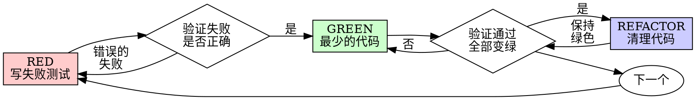

# 测试驱动开发（TDD）

## 概述

先写测试。看它失败。写最少的代码让它通过。

**核心原则：** 如果你没有看到测试失败，你就不知道它是否测试了正确的东西。

**违反规则的字面意思就是违反规则的精神。**

## 何时使用

**总是使用：**
- 新功能
- Bug 修复
- 重构
- 行为变更

**例外情况（请询问你的人类搭档）：**
- 一次性原型
- 生成的代码
- 配置文件

想着"就这一次跳过 TDD"？停下来。那是在找借口。

## 铁律

```
没有失败的测试，就不写生产代码
```

在测试之前就写了代码？删掉它。从头开始。

**没有例外：**
- 不要把它保留为"参考"
- 不要在写测试时"调整"它
- 不要看它
- 删除就是删除

从测试出发重新实现。就这样。

## 红-绿-重构



### RED - 写失败测试

写一个最小的测试来展示应该发生什么。

<Good>
```typescript
test('失败操作重试3次', async () => {
  let attempts = 0;
  const operation = () => {
    attempts++;
    if (attempts < 3) throw new Error('fail');
    return 'success';
  };

  const result = await retryOperation(operation);

  expect(result).toBe('success');
  expect(attempts).toBe(3);
});
```
命名清晰，测试真实行为，只测一件事
</Good>

<Bad>
```typescript
test('重试有效', async () => {
  const mock = jest.fn()
    .mockRejectedValueOnce(new Error())
    .mockRejectedValueOnce(new Error())
    .mockResolvedValueOnce('success');
  await retryOperation(mock);
  expect(mock).toHaveBeenCalledTimes(3);
});
```
命名模糊，测试的是 mock 而不是代码
</Bad>

**要求：**
- 一个行为
- 清晰的命名
- 真实代码（除非万不得已，否则不用 mock）

### 验证 RED - 看它失败

**必须执行。绝不能跳过。**

```bash
npm test path/to/test.test.ts
```

确认：
- 测试失败（不是报错）
- 失败信息符合预期
- 因为功能缺失而失败（不是因为拼写错误）

**测试通过了？** 你在测试已有的行为。修正测试。

**测试报错了？** 修正错误，重新运行直到它正确失败。

### GREEN - 最少的代码

写最简单的代码来通过测试。

<Good>
```typescript
async function retryOperation<T>(fn: () => Promise<T>): Promise<T> {
  for (let i = 0; i < 3; i++) {
    try {
      return await fn();
    } catch (e) {
      if (i === 2) throw e;
    }
  }
  throw new Error('unreachable');
}
```
刚好足够通过
</Good>

<Bad>
```typescript
async function retryOperation<T>(
  fn: () => Promise<T>,
  options?: {
    maxRetries?: number;
    backoff?: 'linear' | 'exponential';
    onRetry?: (attempt: number) => void;
  }
): Promise<T> {
  // YAGNI（你不会需要它）
}
```
过度工程化
</Bad>

不要添加功能、重构其他代码，或超出测试范围的"改进"。

### 验证 GREEN - 看它通过

**必须执行。**

```bash
npm test path/to/test.test.ts
```

确认：
- 测试通过
- 其他测试仍然通过
- 输出干净（没有错误、警告）

**测试失败了？** 修正代码，不是测试。

**其他测试失败了？** 立即修正。

### REFACTOR - 清理代码

只在变绿之后：
- 消除重复
- 改善命名
- 提取辅助函数

保持测试绿色。不要添加行为。

### 重复

为下一个功能写下一个失败的测试。

## 好的测试

| 品质 | 好的 | 坏的 |
|------|------|------|
| **最小化** | 只测一件事。名称中有"和"？拆分它。 | `test('验证邮箱和域名和空格')` |
| **清晰** | 名称描述行为 | `test('测试1')` |
| **展示意图** | 展示期望的 API | 模糊代码应该做什么 |

## 为什么顺序很重要

**"我先写测试后验证它能工作"**

代码之后写的测试会立即通过。立即通过说明不了什么：
- 可能测试了错误的东西
- 可能测试了实现，而不是行为
- 可能遗漏了你忘记的边界情况
- 你从未看到它捕获过 bug

先写测试迫使你看到测试失败，证明它确实在测试某些东西。

**"我已经手动测试了所有边界情况"**

手动测试是临时的。你以为测试了所有东西，但是：
- 没有记录你测试了什么
- 代码变更时无法重新运行
- 压力下容易遗漏情况
- "我试过没问题" ≠ 全面覆盖

自动化测试是系统化的。它们每次都以相同方式运行。

**"删除 X 小时的工作太浪费了"**

沉没成本谬误。时间已经过去了。你现在的选择：
- 删除并用 TDD 重写（再多 X 小时，高信心）
- 保留它并在之后添加测试（30 分钟，低信心，可能有 bug）

"浪费"是保留你不能信任的代码。没有真正测试的工作代码就是技术债务。

**"TDD 是教条主义的，务实意味着灵活变通"**

TDD 本身就是务实的：
- 在提交前发现 bug（比之后调试更快）
- 防止回归（测试立即捕获破坏）
- 记录行为（测试展示如何使用代码）
- 支持重构（自由修改，测试捕获破坏）

"务实"的捷径 = 在生产环境调试 = 更慢。

**"事后测试能达到同样目标 - 重要的是精神不是仪式"**

不。事后测试回答"这做了什么？"先写测试回答"这应该做什么？"

事后测试受你的实现偏见影响。你测试的是你构建的东西，而不是需求。你验证的是你记住的边界情况，而不是发现的边界情况。

先写测试迫使你在实现之前发现边界情况。事后测试验证你记住了所有东西（你并没有）。

30 分钟的事后测试 ≠ TDD。你获得了覆盖率，但失去了测试有效的证明。

## 常见借口

| 借口 | 现实 |
|------|------|
| "太简单不需要测试" | 简单的代码也会出 bug。测试只需要30秒。 |
| "我之后再测试" | 测试立即通过证明不了什么。 |
| "事后测试达到同样目标" | 事后测试 = "这做了什么？" 先写测试 = "这应该做什么？" |
| "已经手动测试过了" | 临时测试 ≠ 系统化测试。没有记录，无法重新运行。 |
| "删除 X 小时的工作太浪费" | 沉没成本谬误。保留未验证的代码才是技术债务。 |
| "保留作为参考，先写测试" | 你会调整它。那就是事后测试。删除就是删除。 |
| "需要先探索" | 可以。扔掉探索结果，用 TDD 开始。 |
| "测试很难写 = 设计不清晰" | 听测试的。难测试 = 难使用。 |
| "TDD 会让我变慢" | TDD 比调试更快。务实 = 先写测试。 |
| "手动测试更快" | 手动测试证明不了边界情况。每次改动都要重新测试。 |
| "现有代码没有测试" | 你正在改进它。为现有代码添加测试。 |

## 红旗 - 停下来从头开始

- 测试之前就写了代码
- 实现之后才写测试
- 测试立即通过
- 无法解释测试为什么失败
- 测试"之后"再添加
- 为"就这一次"找借口
- "我已经手动测试过了"
- "事后测试能达到同样目的"
- "重要的是精神不是仪式"
- "保留作为参考"或"调整现有代码"
- "已经花了 X 小时，删除太浪费"
- "TDD 是教条主义，我是务实的"
- "这次不一样因为……"

**以上所有意味着：删除代码。用 TDD 从头开始。**

## 示例：Bug 修复

**Bug：** 空邮箱被接受

**RED**
```typescript
test('拒绝空邮箱', async () => {
  const result = await submitForm({ email: '' });
  expect(result.error).toBe('邮箱必填');
});
```

**验证 RED**
```bash
$ npm test
FAIL: expected '邮箱必填', got undefined
```

**GREEN**
```typescript
function submitForm(data: FormData) {
  if (!data.email?.trim()) {
    return { error: '邮箱必填' };
  }
  // ...
}
```

**验证 GREEN**
```bash
$ npm test
PASS
```

**REFACTOR**
如果需要，为多个字段提取验证逻辑。

## 验证清单

在标记工作完成之前：

- [ ] 每个新函数/方法都有测试
- [ ] 看到每个测试在实现之前失败
- [ ] 每个测试因为预期原因失败（功能缺失，不是拼写错误）
- [ ] 写了最少的代码来通过每个测试
- [ ] 所有测试通过
- [ ] 输出干净（没有错误、警告）
- [ ] 测试使用真实代码（除非万不得已才用 mock）
- [ ] 边界情况和错误已覆盖

不能勾选所有选项？你跳过了 TDD。从头开始。

## 遇到困难时

| 问题 | 解决方案 |
|------|----------|
| 不知道如何测试 | 写出期望的 API。先写断言。询问你的人类搭档。 |
| 测试太复杂 | 设计太复杂。简化接口。 |
| 必须 mock 所有东西 | 代码耦合太紧。使用依赖注入。 |
| 测试设置很庞大 | 提取辅助函数。仍然复杂？简化设计。 |

## 调试集成

发现 bug？写一个复现它的失败测试。遵循 TDD 循环。测试证明修复并防止回归。

永远不要在没有测试的情况下修复 bug。

## 测试反模式

当添加 mock 或测试工具时，阅读 @testing-anti-patterns.md 以避免常见陷阱：
- 测试 mock 行为而不是真实行为
- 向生产类添加仅测试用的方法
- 在不了解依赖的情况下使用 mock

## 最终规则

```
生产代码 → 测试存在且先失败
否则 → 不是 TDD
```

没有你的人类搭档的许可，没有例外。
