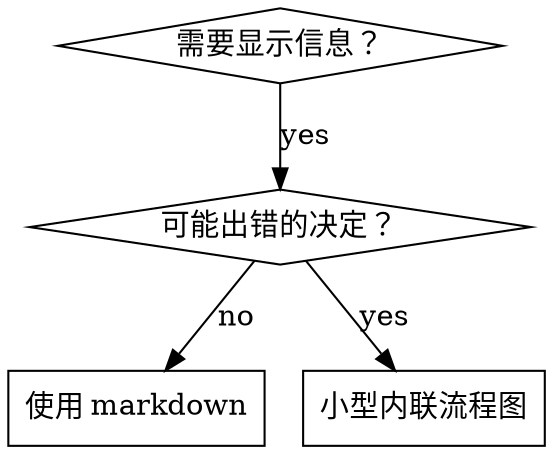

# 编写技能

## 概述

**编写技能就是应用于流程文档的测试驱动开发。**

**个人技能位于特定于代理的目录中（Claude Code 为 `~/.claude/skills`，Codex 为 `~/.agents/skills/`）**

你编写测试用例（带有子代理的压力场景），观察它们失败（基线行为），编写技能（文档），观察测试通过（代理合规），并重构（关闭漏洞）。

**核心原则：**如果你没有看到没有技能时代代理失败的情况，你就不知道技能是否教导了正确的事情。

**必备背景：**在使用此技能之前，你必须理解 superpowers:test-driven-development。该技能定义了基本的 RED-GREEN-REFACTOR 循环。此技能将 TDD 适应于文档。

**官方指导：**有关 Anthropic 的官方技能编写最佳实践，请参阅 anthropic-best-practices.md。本文档提供了补充此技能中 TDD 专注方法的额外模式和指南。

## 什么是技能？

**技能**是经过验证的技术、模式或工具的参考指南。技能帮助未来的 Claude 实例找到并应用有效的方法。

**技能是：**可重用的技术、模式、工具、参考指南

**技能不是：**关于你如何解决一次问题的叙述

## 技能的 TDD 映射

| TDD 概念 | 技能创建 |
|-------------|----------------|
| **测试用例** | 带有子代理的压力场景 |
| **生产代码** | 技能文档（SKILL.md） |
| **测试失败（RED）** | 代理在没有技能的情况下违反规则（基线） |
| **测试通过（GREEN）** | 代理在存在技能的情况下合规 |
| **重构** | 在保持合规的同时关闭漏洞 |
| **先编写测试** | 在编写技能之前运行基线场景 |
| **观察它失败** | 逐字记录代理使用的确切合理化 |
| **最小代码** | 编写解决那些特定违规的技能 |
| **观察它通过** | 验证代理现在合规 |
| **重构循环** | 找到新的合理化 → 堵塞 → 重新验证 |

整个技能创建过程遵循 RED-GREEN-REFACTOR。

## 何时创建技能

**在以下情况下创建：**
- 技术对你来说并不直观
- 你会在项目中再次参考它
- 模式广泛适用（非项目特定）
- 其他人会受益

**不要创建用于：**
- 一次性解决方案
- 在其他地方有充分记录的标准实践
- 项目特定约定（放在 CLAUDE.md 中）
- 机械约束（如果可以通过正则表达式/验证强制执行，请自动化它——将文档保留给判断调用）

## 技能类型

### 技术
具有遵循步骤的具体方法（基于条件的等待、根本原因跟踪）

### 模式
思考问题的方式（用标志扁平化、测试不变式）

### 参考
API 文档、语法指南、工具文档（office 文档）

## 目录结构


```
skills/
  skill-name/
    SKILL.md              # 主要参考（必需）
    supporting-file.*     # 仅在需要时
```

**扁平命名空间** - 所有技能在一个可搜索的命名空间中

**为以下内容分离文件：**
1. **繁重的参考**（100+ 行） - API 文档、综合语法
2. **可重用的工具** - 脚本、实用程序、模板

**保持内联：**
- 原则和概念
- 代码模式（< 50 行）
- 其他所有内容

## SKILL.md 结构

**前置内容（YAML）：**
- 两个必需字段：`name` 和 `description`（有关所有支持字段，请参阅 [agentskills.io/specification](https://agentskills.io/specification)）
- 最多 1024 个字符
- `name`：仅使用字母、数字和连字符（无括号、特殊字符）
- `description`：第三人称，仅描述何时使用（而非它做什么）
  - 以"Use when..."开头以专注于触发条件
  - 包括特定症状、情况和上下文
  - **切勿总结技能的流程或工作流程**（请参阅 CSO 部分了解原因）
  - 如果可能，保持在 500 个字符以下

```markdown
---
name: Skill-Name-With-Hyphens
description: 在 [特定触发条件和症状] 时使用
---

# 技能名称

## 概述
这是什么？核心原则用1-2句话。

## 何时使用
[如果决策不明显，则使用小型内联流程图]

带有症状和用例的项目列表
何时不使用

## 核心模式（用于技术/模式）
之前/之后代码比较

## 快速参考
用于扫描常见操作的表或项目

## 实现
简单模式的内联代码
繁重参考或可重用工具的文件链接

## 常见错误
哪里出错了 + 修复

## 现实世界影响（可选）
具体结果
```


## Claude 搜索优化（CSO）

**对发现至关重要：**未来的 Claude 需要找到你的技能

### 1. 丰富的描述字段

**目的：**Claude 读取描述以决定为给定任务加载哪些技能。使其回答："我现在应该阅读这个技能吗？"

**格式：**以"Use when..."开头以专注于触发条件

**关键：描述 = 何时使用，而非技能做什么**

描述应仅描述触发条件。不要在描述中总结技能的流程或工作流程。

**为什么这很重要：**测试表明，当描述总结技能的工作流程时，Claude 可能会遵循描述而不是阅读完整的技能内容。说"任务之间的代码审查"的描述导致 Claude 进行一次审查，即使技能的流程图清楚地显示了两次审查（规范合规然后代码质量）。

当描述更改为"在当前会话中执行具有独立任务的实现计划时使用"（无工作流程摘要）时，Claude 正确地阅读了流程图并遵循了两阶段审查流程。

**陷阱：**总结工作流程的描述创建了 Claude 将采用的捷径。技能正文成为 Claude 跳过的文档。

```yaml
# ❌ 糟糕：总结工作流程 - Claude 可能遵循此而不是阅读技能
description: 在执行计划时使用 - 在任务之间进行代码审查，每任务分派子代理

# ❌ 糟糕：过多的流程细节
description: 用于 TDD - 先编写测试，观察它失败，编写最小代码，重构

# ✅ 好：仅触发条件，无工作流程摘要
description: 在当前会话中执行具有独立任务的实现计划时使用

# ✅ 好：仅触发条件
description: 在实现任何功能或错误修复之前，在编写实现代码之前使用
```

**内容：**
- 使用具体触发器、症状和表明此技能适用的情况
- 描述*问题*（竞争条件、不一致的行为）而不是*特定于语言的症状*（setTimeout、sleep）
- 保持触发器与技术无关，除非技能本身特定于技术
- 如果技能特定于技术，则在触发器中明确说明
- 以第三人称编写（注入到系统提示中）
- **切勿总结技能的流程或工作流程**

```yaml
# ❌ 糟糕：太抽象、模糊，不包括何时使用
description: 用于异步测试

# ❌ 糟糕：第一人称
description: 当测试不稳定时，我可以帮助你进行异步测试

# ❌ 糟糕：提到技术但技能并非特定于它
description: 当测试使用 setTimeout/sleep 并且不稳定时使用

# ✅ 好：以"Use when"开头，描述问题，无工作流程
description: 当测试具有竞争条件、时间依赖性或不一致地通过/失败时使用

# ✅ 好：具有显式触发的技术特定技能
description: 当使用 React Router 并处理认证重定向时使用
```

### 2. 关键字覆盖

使用 Claude 会搜索的词：
- 错误消息："Hook timed out"、"ENOTEMPTY"、"race condition"
- 症状："flaky"、"hanging"、"zombie"、"pollution"
- 同义词："timeout/hang/freeze"、"cleanup/teardown/afterEach"
- 工具：实际命令、库名称、文件类型

### 3. 描述性命名

**使用主动语态，动词优先：**
- ✅ `creating-skills` 而不是 `skill-creation`
- ✅ `condition-based-waiting` 而不是 `async-test-helpers`

### 4. Token 效率（关键）

**问题：**getting-started 和经常引用的技能加载到每个对话中。每个 token 都很重要。

**目标字数：**
- getting-started 工作流程：每个少于 150 字
- 经常加载的技能：总共少于 200 字
- 其他技能：少于 500 字（仍然简洁）

**技术：**

**将细节移至工具帮助：**
```bash
# ❌ 糟糕：在 SKILL.md 中记录所有标志
search-conversations 支持 --text、--both、--after DATE、--before DATE、--limit N

# ✅ 好：引用 --help
search-conversations 支持多种模式和过滤器。运行 --help 了解详细信息。
```

**使用交叉引用：**
```markdown
# ❌ 糟糕：重复工作流程细节
搜索时，使用模板分派子代理...
[20行重复指令]

# ✅ 好：引用其他技能
始终使用子代理（节省 50-100x 上下文）。必需：使用 [other-skill-name] 进行工作流程。
```

**压缩示例：**
```markdown
# ❌ 糟糕：冗长的示例（42 字）
你的人类伙伴："我们以前是如何在 React Router 中处理认证错误的？"
你：我将搜索过去对话中的 React Router 认证模式。
[分派子代理，搜索查询："React Router authentication error handling 401"]

# ✅ 好：最小的示例（20 字）
伙伴："我们以前如何在 React Router 中处理认证错误？"
你：搜索中...
[分派子代理 → 综合]
```

**消除冗余：**
- 不要重复交叉引用技能中的内容
- 不要解释从命令中显而易见的内容
- 不要包含同一模式的多个示例

**验证：**
```bash
wc -w skills/path/SKILL.md
# getting-started 工作流程：目标是每个少于 150
# 其他经常加载：总共少于 200
```

**按照你做的事情或核心见解命名：**
- ✅ `condition-based-waiting` > `async-test-helpers`
- ✅ `using-skills` 而不是 `skill-usage`
- ✅ `flatten-with-flags` > `data-structure-refactoring`
- ✅ `root-cause-tracing` > `debugging-techniques`

**动名词（-ing）适用于流程：**
- `creating-skills`、`testing-skills`、`debugging-with-logs`
- 主动，描述你正在采取的行动

### 4. 交叉引用其他技能

**在编写引用其他技能的文档时：**

仅使用技能名称，并带有显式需求标记：
- ✅ 好：`**必需子技能：**使用 superpowers:test-driven-development`
- ✅ 好：`**必备背景：**你必须理解 superpowers:systematic-debugging`
- ❌ 糟糕：`参见 skills/testing/test-driven-development`（不清楚是否必需）
- ❌ 糟糕：`@skills/testing/test-driven-development/SKILL.md`（强制加载，消耗上下文）

**为什么没有 @ 链接：**`@` 语法立即强制加载文件，在需要之前消耗 200k+ 上下文。

## 流程图使用



**仅将流程图用于：**
- 非显而易见的决策点
- 可能过早停止的流程循环
- "何时使用 A 与 B"决策

**切勿将流程图用于：**
- 参考材料 → 表、列表
- 代码示例 → Markdown 块
- 线性指令 → 编号列表
- 没有语义含义的标签（step1、helper2）

参见 @graphviz-conventions.dot 了解 graphviz 样式规则。

**为你的人类伙伴可视化：**使用此目录中的 `render-graphs.js` 将技能的流程图渲染为 SVG：
```bash
./render-graphs.js ../some-skill           # 每个图单独
./render-graphs.js ../some-skill --combine # 所有图在一个 SVG 中
```

## 代码示例

**一个优秀的示例胜过许多平庸的示例**

选择最相关的语言：
- 测试技术 → TypeScript/JavaScript
- 系统调试 → Shell/Python
- 数据处理 → Python

**好的示例：**
- 完整且可运行
- 解释为什么的注释良好
- 来自真实场景
- 清晰显示模式
- 准备好适应（不是通用模板）

**不要：**
- 用 5+ 种语言实现
- 创建填空模板
- 编写人为的示例

你擅长移植 - 一个优秀的示例就足够了。

## 文件组织

### 自包含技能
```
defense-in-depth/
  SKILL.md    # 所有内联
```
何时：所有内容都适合，不需要繁重的参考

### 带有可重用工具的技能
```
condition-based-waiting/
  SKILL.md    # 概述 + 模式
  example.ts  # 可适应的工作助手
```
何时：工具是可重用的代码，而不仅仅是叙述

### 带有繁重参考的技能
```
pptx/
  SKILL.md       # 概述 + 工作流程
  pptxgenjs.md   # 600 行 API 参考
  ooxml.md       # 500 行 XML 结构
  scripts/       # 可执行工具
```
何时：参考材料太大而无法内联

## 铁律（与 TDD 相同）

```
没有失败的测试，就没有技能
```

这适用于新技能和现有技能的编辑。

在测试之前编写技能？删除它。重新开始。
在没有测试的情况下编辑技能？同样的违规。

**无例外：**
- 不用于"简单的添加"
- 不用于"只是添加一部分"
- 不用于"文档更新"
- 不要将未经测试的更改作为"参考"保留
- 不要在运行测试时"适应"
- 删除意味着删除

**必备背景：**superpowers:test-driven-development 技能解释了为什么这很重要。同样的原则适用于文档。

## 测试所有技能类型

不同的技能类型需要不同的测试方法：

### 强制执行纪律的技能（规则/要求）

**示例：**TDD、完成前验证、设计前编码

**测试用：**
- 学术问题：他们理解规则吗？
- 压力场景：他们在压力下合规吗？
- 结合多种压力：时间 + 沉没成本 + 疲劳
- 识别合理化并添加显式反制措施

**成功标准：**代理在最大压力下遵循规则

### 技术技能（操作指南）

**示例：**基于条件的等待、根本原因跟踪、防御性编程

**测试用：**
- 应用场景：他们能正确应用技术吗？
- 变化场景：他们能处理边缘情况吗？
- 缺失信息测试：指令有漏洞吗？

**成功标准：**代理成功将技术应用于新场景

### 模式技能（心智模型）

**示例：**降低复杂性、信息隐藏概念

**测试用：**
- 识别场景：他们能识别模式何时适用吗？
- 应用场景：他们能使用心智模型吗？
- 反例：他们知道何时不应用吗？

**成功标准：**代理正确识别如何/何时应用模式

### 参考技能（文档/API）

**示例：**API 文档、命令参考、库指南

**测试用：**
- 检索场景：他们能找到正确的信息吗？
- 应用场景：他们能正确使用他们找到的内容吗？
- 缺口测试：常见的用例是否覆盖？

**成功标准：**代理找到并正确应用参考信息

## 跳过测试的常见合理化

| 借口 | 现实 |
|--------|---------|
| "技能显然很清楚" | 对你清楚 ≠ 对其他代理清楚。测试它。 |
| "这只是一个参考" | 参考可能有漏洞、不清楚的部分。测试检索。 |
| "测试是过度的" | 未经测试的技能有问题。总是这样。15分钟测试可以节省数小时。 |
| "如果出现问题我会测试" | 问题 = 代理无法使用技能。在部署之前测试。 |
| "测试太繁琐" | 测试比在生产环境中调试糟糕的技能更不繁琐。 |
| "我确信它很好" | 过度自信保证有问题。无论如何测试。 |
| "学术审查就足够了" | 阅读 ≠ 使用。测试应用场景。 |
| "没时间测试" | 部署未经测试的技能会浪费更多时间来修复它。 |

**所有这些都意味着：在部署之前测试。无例外。**

## 防弹技能以防止合理化

强制执行纪律的技能（如 TDD）需要抵御合理化。代理很聪明，在压力下会找到漏洞。

**心理学注释：**理解为什么说服技术有效有助于你系统地应用它们。请参阅 persuasion-principles.md 了解关于权威、承诺、稀缺性、社会认同和团结原则的研究基础（Cialdini, 2021; Meincke et al., 2025）。

### 明确关闭每个漏洞

不要只是陈述规则 - 禁止特定的变通方法：

<Bad>
```markdown
在测试之前编写代码？删除它。
```
</Bad>

<Good>
```markdown
在测试之前编写代码？删除它。重新开始。

**无例外：**
- 不要将其作为"参考"保留
- 不要在编写测试时"适应"它
- 不要看它
- 删除意味着删除
```
</Good>

### 解决"精神与字面"参数

早期添加基础原则：

```markdown
**违反规则的字面就是违反规则的精神。**
```

这切断了整个类别的"我在遵循精神"合理化。

### 构建合理化表

从基线测试中捕获合理化（请参阅下面的测试部分）。代理做出的每个借口都进入表中：

```markdown
| 借口 | 现实 |
|--------|---------|
| "太简单无法测试" | 简单的代码会出错。测试需要30秒。 |
| "我稍后会测试" | 测试立即通过证明不了什么。 |
| "测试后达到相同的目标" | 测试后 = "这做什么？"测试前 = "这应该做什么？" |
```

### 创建红旗列表

使代理在合理化时易于自我检查：

```markdown
## 红旗 - 停止并重新开始

- 测试前的代码
- "我已经手动测试过了"
- "测试后达到相同的目的"
- "这关乎精神而非仪式"
- "这不同，因为..."

**所有这些都意味着：删除代码。用 TDD 重新开始。**
```

### 更新违规症状的 CSO

添加到描述：你将要违规时的症状：

```yaml
description: 在实现任何功能或错误修复之前，在编写实现代码之前使用
```

## 技能的 RED-GREEN-REFACTOR

遵循 TDD 循环：

### RED：编写失败的测试（基线）

在没有技能的情况下使用子代理运行压力场景。记录确切的行为：
- 他们做出了什么选择？
- 他们使用了什么合理化（逐字）？
- 哪些压力触发了违规？

这是"观察测试失败" - 在编写技能之前，你必须看到代理自然做什么。

### GREEN：编写最小技能

编写解决那些特定合理化的技能。不要为假设情况添加额外内容。

使用技能运行相同的场景。代理现在应该合规。

### REFACTOR：关闭漏洞

代理找到了新的合理化？添加显式反制。重新测试直到防弹。

**测试方法：**请参阅 @testing-skills-with-subagents.md 了解完整的测试方法：
- 如何编写压力场景
- 压力类型（时间、沉没成本、权威、疲劳）
- 系统性地堵塞漏洞
- 元测试技术

## 反模式

### ❌ 叙述示例
"在 2025-10-03 会话中，我们发现空 projectDir 导致..."
**为什么糟糕：**太具体，不可重用

### ❌ 多语言稀释
example-js.js、example-py.py、example-go.go
**为什么糟糕：**平庸的质量，维护负担

### ❌ 流程图中的代码
```dot
step1 [label="import fs"];
step2 [label="read file"];
```
**为什么糟糕：**无法复制粘贴，难以阅读

### ❌ 通用标签
helper1、helper2、step3、pattern4
**为什么糟糕：**标签应具有语义含义

## 停止：在移动到下一个技能之前

**在编写任何技能之后，你必须停止并完成部署流程。**

**不要：**
- 在没有测试每个的情况下批量创建多个技能
- 在当前技能验证之前移动到下一个技能
- 因为"批处理更高效"而跳过测试

**下面的部署检查清单对于每个技能都是强制性的。**

部署未经测试的技能 = 部署未经测试的代码。这违反质量标准。

## 技能创建检查清单（TDD 适应）

**重要：**使用 TodoWrite 为下面检查清单中的每个项目创建待办事项。

**RED 阶段 - 编写失败的测试：**
- [ ] 创建压力场景（对于纪律技能，3+ 种组合压力）
- [ ] 在没有技能的情况下运行场景 - 逐字记录基线行为
- [ ] 识别合理化/失败中的模式

**GREEN 阶段 - 编写最小技能：**
- [ ] 名称仅使用字母、数字、连字符（无括号/特殊字符）
- [ ] 带有必需的 `name` 和 `description` 字段的 YAML 前置内容（最多 1024 个字符；请参阅 [spec](https://agentskills.io/specification)）
- [ ] 描述以"Use when..."开头并包括特定触发器/症状
- [ ] 描述以第三人称编写
- [ ] 全文包含用于搜索的关键字（错误、症状、工具）
- [ ] 带有核心原则的清晰概述
- [ ] 解决 RED 中识别的特定基线失败
- [ ] 代码内联或链接到单独的文件
- [ ] 一个优秀的示例（不是多语言）
- [ ] 在有技能的情况下运行场景 - 验证代理现在合规

**REFACTOR 阶段 - 关闭漏洞：**
- [ ] 从测试中识别新的合理化
- [ ] 添加显式反制措施（如果是纪律技能）
- [ ] 从所有测试迭代构建合理化表
- [ ] 创建红旗列表
- [ ] 重新测试直到防弹

**质量检查：**
- [ ] 仅在决策不明显时使用小流程图
- [ ] 快速参考表
- [ ] 常见错误部分
- [ ] 没有叙述性故事讲述
- [ ] 仅用于工具或繁重参考的支持文件

**部署：**
- [ ] 将技能提交到 git 并推送到你的分支（如果已配置）
- [ ] 考虑通过 PR 贡献回来（如果广泛有用）

## 发现工作流程

未来的 Claude 如何找到你的技能：

1. **遇到问题**（"测试不稳定"）
3. **找到技能**（描述匹配）
4. **扫描概述**（这相关吗？）
5. **阅读模式**（快速参考表）
6. **加载示例**（仅在实现时）

**为此流程优化** - 尽早并频繁放置可搜索的术语。

## 底线

**创建技能就是文档的 TDD。**

相同的铁律：没有失败的测试，就没有技能。
相同的循环：RED（基线）→ GREEN（编写技能）→ REFACTOR（关闭漏洞）。
相同的收益：更好的质量，更少的意外，防弹的结果。

如果你对代码遵循 TDD，请对技能遵循 TDD。这是应用于文档的相同纪律。
